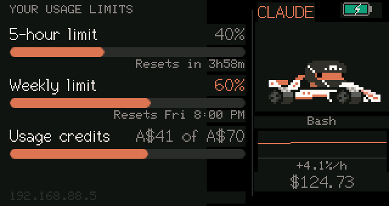
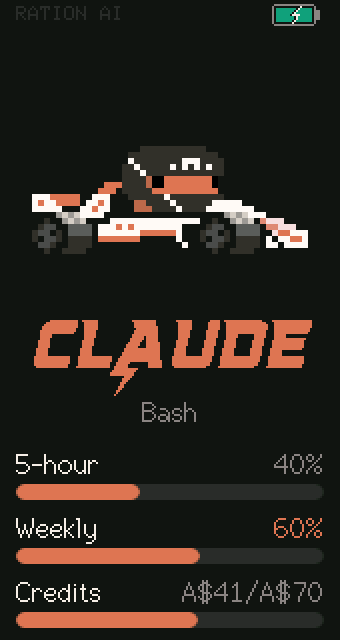
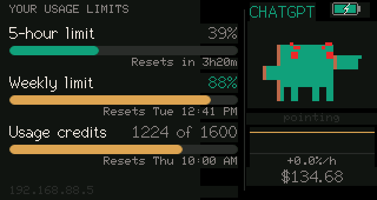
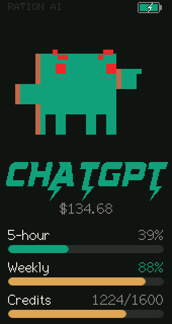
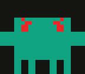

# RationAI

A desk gauge for your Claude and ChatGPT plan allowance, on a LilyGO
T-Display-S3.

It answers the question you'd otherwise alt-tab for: *how much have I got
left, and is Claude waiting on me?*



- **Real plan limits**, not estimates: the same 5-hour, weekly and credit
  windows Claude Code's own `/usage` panel shows, plus the ChatGPT/Codex
  equivalents.
- **A live avatar.** The mascot animates in step with your Claude Code session
  and **waves when Claude is blocked waiting on you**, so you can tell from
  across the desk without switching windows.
- **Trend at a glance.** A sparkline for the binding window and a burn rate.
- **Two brands, two layouts.** Claude or ChatGPT, landscape or portrait totem.
- **Zero configuration when you move.** The server advertises itself over
  Bonjour; the display finds whichever laptop is running it, on any network.

## The screens

Three taps of BOOT switches brand; four taps of KEY flips the layout.

| | Landscape | Portrait totem |
| --- | --- | --- |
| **Claude** |  |  |
| **ChatGPT** |  |  |

## The mascot

Claude Code hooks tell the display what the session is doing, and the mascot
follows, so a glance tells you whether to look back at your editor.

|  |  |  |  |
| :---: | :---: | :---: | :---: |
| **thinking** | **searching**<br>Grep, Glob, WebSearch | **running a command**<br>Bash | **needs you**<br>blocked on a prompt |

With no hooks installed it falls back to your quota level instead, getting
progressively less cheerful as the tightest limit fills.

### The evil twin



In ChatGPT mode the mascot turns evil: green body, red eyes, angled brows.

<br clear="right">

## How it works

```
Mac                                              ESP32-S3
├─ Claude:  OAuth token from Keychain               │
│           → GET /api/oauth/usage                  │
├─ ChatGPT: token from ~/.codex/auth.json           │
│           → GET /backend-api/codex/usage          │
├─ Hooks:   Claude Code POSTs session events        │
├─ trend:   rolling history → slope, projection     │
└─ serves  :8787, advertised as _rationai._tcp ──WiFi►┘  polls, draws
```

**The board holds no credentials.** It reads JSON off the LAN and nothing else.
Tokens stay on the Mac, where they already live.

Neither usage endpoint is a published API, so they may change without notice.
When a reading can't be refreshed the display marks it `stale` rather than
showing a number that might be wrong.

## Quick start

**1. Server, on the Mac that has Claude Code signed in:**

```bash
bash server/install.sh
```

Installs a launchd agent. Works on a second laptop as-is, and needs nothing
beyond the Python that ships with macOS.

**2. Firmware, with the board on USB:**

```bash
pio run -d firmware -t upload
```

**3. On first boot**, join the WiFi network `RationAI-Setup` from a phone and
pick your network. Leave the server host blank; discovery handles it. The
board remembers four networks, so home, work and a phone hotspot all just work.

Full operating instructions, every button gesture, and the troubleshooting
table are in **[MANUAL.md](MANUAL.md)**.

## Flashing with an AI agent

If you'd rather not touch a terminal, paste **[AGENT.md](AGENT.md)** into Claude
Code, Codex, or any coding agent with shell access. It's written as a complete
brief: toolchain install, build, the recovery procedure for this board's
finicky USB, and how to verify the result.

## Repo layout

| Path | |
| --- | --- |
| `firmware/src/main.cpp` | the whole display application |
| `firmware/platformio.ini` | board and TFT_eSPI config, all via build flags |
| `server/usage_server.py` | HTTP server, `/usage` and `/live` |
| `server/claude_live.py` | Claude allowance |
| `server/codex_live.py` | ChatGPT/Codex allowance |
| `server/activity.py` | hook events, burn rate, session cost |
| `server/history.py` | rolling samples, slope, projection |
| `MANUAL.md` | operating manual |
| `AGENT.md` | brief for an AI agent to build and flash |

## Hardware

- [LilyGO T-Display-S3](https://github.com/Xinyuan-LilyGO/T-Display-S3):
  ESP32-S3, 170×320 ST7789, two buttons, LiPo connector
- A USB-C **data** cable. A marginal one will fail mid-flash; see MANUAL.md.
- Optional 3.7V LiPo for untethered use

## Notes on bundled assets

`firmware/src/splash_animations.h` holds Anthropic's Clawd mascot animations,
and `firmware/src/SuperchargeCn18.h` is a converted commercial font. Both are
included here for personal use on the author's own devices and are not offered
for redistribution.
